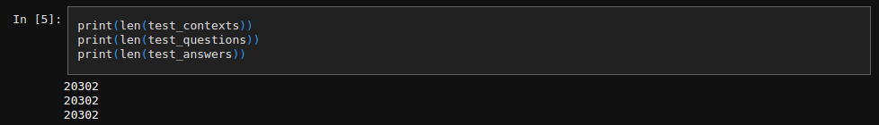
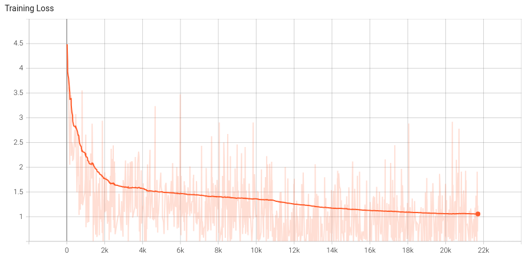
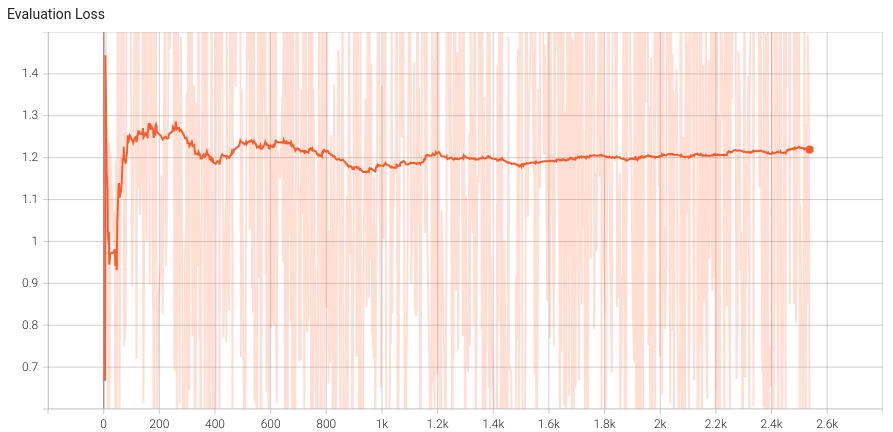

# Lab-AI - HPC-Tools

## Introduction 

This repository focuses on parallelizing the training loop of a machine learning model and analyzing key metrics such as efficiency and speedup in comparison to the sequential implementation.

The repository is divided into two parts:

1. **BASELINE**: A sequential implementation of a training loop on a BERT model using the SQuAD dataset.
2. **DISTRIBUTED**: The parallelized version of the code, along with performance metrics and comparisons.

## BASELINE

A significant part of the model implementation in this section is based on a notebook found online: [BERT-based pretrained model using SQuAD 2.0 dataset](https://github.com/alexaapo/BERT-based-pretrained-model-using-SQuAD-2.0-dataset). I have adapted the notebook to suit the objectives of this project.

### Data, model and optimizer

I selected the SQuAD2.0 which is composed by more than 100 000 questions.

86 000 for the training set : 


20 000 for the evaluation set : 



I chose the model BertForQuestionAnswering because it perfectly meets the requirements :

https://github.com/PaulSerin/Lab-AI---HPC-Tools/blob/34dd05fcbd2f22eb06f9e35e49af5a04bc082a7b/BASELINE.py#L201

I used the AdamW optimizer with a learning rate of 5e-5 :

https://github.com/PaulSerin/Lab-AI---HPC-Tools/blob/34dd05fcbd2f22eb06f9e35e49af5a04bc082a7b/BASELINE.py#L204


### Code

This section includes the following:

- A detailed notebook explaining the steps taken to train the model: [BASELINE.ipynb](https://github.com/PaulSerin/Lab-AI---HPC-Tools/blob/main/BASELINE.ipynb).
- A Python script that trains the model for 2 epochs and evaluates it on a test dataset: [BASELINE.py](https://github.com/PaulSerin/Lab-AI---HPC-Tools/blob/main/BASELINE.py).

To run the training script on an A100 GPU, you can use the following command:

```
sbatch run.sh
```


This will generate an output similar to this SLURM output file: [slurm-8705441.out](https://github.com/PaulSerin/Lab-AI---HPC-Tools/blob/main/slurm-8705441.out), but the file name will match the corresponding SLURM job ID.

### Results

You can find the results of the training loop here:

https://github.com/PaulSerin/Lab-AI---HPC-Tools/blob/693edd42dcd61574d18b0b798045b69d592c26b6/slurm-8703817.out#L247-L249

https://github.com/PaulSerin/Lab-AI---HPC-Tools/blob/1d9f1d90a416b68af08f99c09e14a8046a09d4c7/slurm-8703817.out#L5789-L5791

The total training time for 2 epochs on the full dataset is approximately **1 hour**, with a final training loss of **0.88**.

The validation loss is also very low at **0.55**, indicating strong model performance.

### Visualization

You can visualize the evolution of the training and validation loss using TensorBoard by running:

```
tensorboard --logdir=logs/fit
```

Below is a snapshot of the results obtained from my experiments:



 

*1. Evolution of the Training Loss (from 4 to 1)*

The training loss starts at 4 and decreases to 1, which shows that the model is learning effectively from the training data. This indicates that the optimizer is working properly, and the model is adjusting its weights to make better predictions on the training set.

*2. Validation Loss of 1.2 and Training Loss of 1*

With a validation loss of 1.2 and a training loss around 1, the values are quite close, which is a good sign. It suggests that the model generalizes well to the validation data and is not overfitting to the training data. 

The slight difference (1.2 in validation vs 1 in training) is normal, as the validation data is unseen, and performance is typically a bit lower on these samples compared to the training set.


*NB : There are many oscillations when observing the light orange lines because the loss function was calculated at each batch. It is the progression of the moving average, shown in solid dark orange, that should be followed.*


