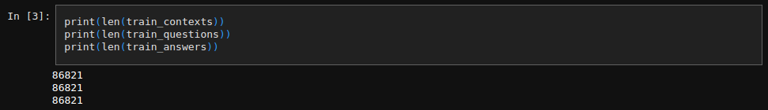

# Lab-AI - HPC-Tools

## Introduction 

This repository focuses on parallelizing the training loop of a machine learning model and analyzing key metrics such as efficiency and speedup in comparison to the sequential implementation.

The repository is divided into two parts:

1. **BASELINE**: A sequential implementation of a training loop on a BERT model using the SQuAD dataset.
2. **DISTRIBUTED**: The parallelized version of the code, along with performance metrics and comparisons.

## BASELINE

A significant part of the model implementation in this section is based on a notebook found online: [BERT-based pretrained model using SQuAD 2.0 dataset](https://github.com/alexaapo/BERT-based-pretrained-model-using-SQuAD-2.0-dataset). I have adapted the notebook to suit the objectives of this project.

### Data, model and optimizer

I selected the SQuAD2.0 which is composed by more than 100 000 questions.

86 000 for the training set : 




20 000 for the evaluation set : 


I chose the model BertForQuestionAnswering because it perfectly meets the requirements :

https://github.com/PaulSerin/Lab-AI---HPC-Tools/blob/34dd05fcbd2f22eb06f9e35e49af5a04bc082a7b/BASELINE.py#L201

I used the AdamW optimizer with a learning rate of 5e-5 :

https://github.com/PaulSerin/Lab-AI---HPC-Tools/blob/34dd05fcbd2f22eb06f9e35e49af5a04bc082a7b/BASELINE.py#L204


### Code

This section includes the following:

- A detailed notebook explaining the steps taken to train the model: [BASELINE.ipynb](https://github.com/PaulSerin/Lab-AI---HPC-Tools/blob/main/BASELINE.ipynb).
- A Python script that trains the model for 2 epochs and evaluates it on a test dataset: [BASELINE.py](https://github.com/PaulSerin/Lab-AI---HPC-Tools/blob/main/BASELINE.py).

To run the training script on an A100 GPU, you can use the following command:

```
sbatch run.sh
```


This will generate an output similar to this SLURM output file: [slurm-8705441.out](https://github.com/PaulSerin/Lab-AI---HPC-Tools/blob/main/slurm-8705441.out), but the file name will match the corresponding SLURM job ID.

### Results

You can find the results of the training loop here:

https://github.com/PaulSerin/Lab-AI---HPC-Tools/blob/693edd42dcd61574d18b0b798045b69d592c26b6/slurm-8703817.out#L247-L249

https://github.com/PaulSerin/Lab-AI---HPC-Tools/blob/1d9f1d90a416b68af08f99c09e14a8046a09d4c7/slurm-8703817.out#L5789-L5791

The total training time for 2 epochs on the full dataset is approximately **1 hour**, with a final training loss of **0.88**.

The validation loss is also very low at **0.55**, indicating strong model performance.

### Visualization

You can visualize the evolution of the training and validation loss using TensorBoard by running:

```
tensorboard --logdir=logs/fit
```

Below is a snapshot of the results obtained from my experiments:


 

*1. Evolution of the Training Loss (from 4 to 1)*

The training loss starts at 4 and decreases to 1, which shows that the model is learning effectively from the training data. This indicates that the optimizer is working properly, and the model is adjusting its weights to make better predictions on the training set.

*2. Validation Loss of 1.2 and Training Loss of 1*

With a validation loss of 1.2 and a training loss around 1, the values are quite close, which is a good sign. It suggests that the model generalizes well to the validation data and is not overfitting to the training data. 

The slight difference (1.2 in validation vs 1 in training) is normal, as the validation data is unseen, and performance is typically a bit lower on these samples compared to the training set.


*NB : There are many oscillations when observing the light orange lines because the loss function was calculated at each batch. It is the progression of the moving average, shown in solid dark orange, that should be followed.*


## DISTRIBUTED

In this part of the project, we focus on parallelizing the training loop of the baseline implementation using different work distribution methods such as Distributed Data Parallel (DDP), Fully Sharded Data Parallel (FSDP), and DeepSpeed. The goal is to analyze the speedup and performance improvements compared to the sequential version. 

For the parallelization, we used the **PyTorch Lightning** library, which greatly simplifies the process of managing distributed training. Below is the batch script executed on the supercomputer:

```bash
#!/bin/bash -l
#SBATCH --nodes=2               # node count
#SBATCH --ntasks-per-node=2      # total number of tasks per node
#SBATCH --cpus-per-task=32       # cpu-cores per task (>1 if multi-threaded tasks)
#SBATCH --mem=64G                # total memory per node (4 GB per cpu-core is default)
#SBATCH --gres=gpu:a100:2        # number of gpus per node
#SBATCH --time=00:30:00          # total run time limit (HH:MM:SS)
```

This configuration leverages 2 nodes with 2 GPUs (Nvidia A100) on each node, 64 CPUs per node, and a total runtime of 30 minutes.

As with the baseline, this section includes a notebook and Python script:

 - DISTRIBUTED.ipynb : A notebook parallelized using the ddp_notebook strategy.
 - DISTRIBUTED.py : The parallelized version of BASELINE.py, which is the primary focus of the performance analysis.

PyTorch Lightning Implementation
We leveraged PyTorch Lightning to simplify the parallelization process. The library provides built-in support for distributed strategies and offers several useful features, such as easier configuration of callbacks, logging, and checkpointing.

### Code Implementation

The implementation leverages **PyTorch Lightning**, which greatly simplifies the process of managing training, especially when it comes to distributed environments. Lightning abstracts away much of the boilerplate code typically needed for training loops, making it easier to focus on core model development and experimentation.

#### TimeCallback

I used the `TimeCallback` to measure and display the execution time of the training process. This callback tracks the start and end times of the training and calculates the total duration. It also prints the time in a human-readable format, providing immediate feedback on how long each training session takes. This is particularly useful when comparing different distributed strategies and assessing performance.

#### MySlurmCallback

The `MySlurmCallback` was implemented to print specific job information related to SLURM, which is the job scheduling system used on the supercomputer. It captures the SLURM job ID, process rank, and the GPU device being used, helping to track which resources were allocated for each training process. This information is valuable for debugging and performance monitoring in a multi-node distributed setup.

#### BertLightning

The `BertLightning` class extends **PyTorch Lightning's** `LightningModule` and encapsulates the entire model's logic, including forward propagation, training, and validation steps. By defining the `training_step` and `validation_step` methods, it simplifies the training loop, automatically handling backpropagation, loss calculation, and logging. The model uses `BertForQuestionAnswering` from the Hugging Face library, and its structure is designed to be modular, allowing easy modifications such as switching out optimizers or tweaking the learning rate.

Additionally, `BertLightning` tracks and logs both the current loss (for the last batch) and the average training loss at the end of each epoch. This gives a more comprehensive view of the model's performance throughout the training process.

#### Trainer

The `Trainer` object in **PyTorch Lightning** is where the distributed strategy is set, and it controls the entire training process. It simplifies the orchestration of multi-node, multi-GPU training by allowing you to specify the number of GPUs, nodes, and distribution strategy (e.g., DDP, FSDP, or DeepSpeed). 

In this case, `Trainer` was configured with:
- A dynamic `strategy` selection based on user input (either DDP, FSDP, or DeepSpeed).
- Callbacks for early stopping, model checkpointing, learning rate monitoring, and time tracking.
- Use of multiple nodes and GPUs as specified in the SLURM script.

This makes the process highly configurable, allowing you to experiment with different distribution strategies with minimal code changes, making it easier to scale your model training across different hardware setups.


### How to Run the Code

To run the code, the user needs to submit the `runDISTRIBUTED.sh` script using the `sbatch` command. This will allocate the necessary resources on the SLURM-managed cluster and begin the distributed training process. The command to run the script is:

```bash
sbatch runDISTRIBUTED.sh
```

Before executing the script, the user can specify the desired strategy for distributing work across the available nodes and GPUs. The script includes several pre-configured strategies, and the user simply needs to uncomment the desired strategy in the .sh file. For example, to switch between ddp, fsdp, or deepspeed, the user should edit the following section:

# Work distribution strategies
# STRATEGY="ddp"
# STRATEGY="fsdp"
STRATEGY="deepspeed"